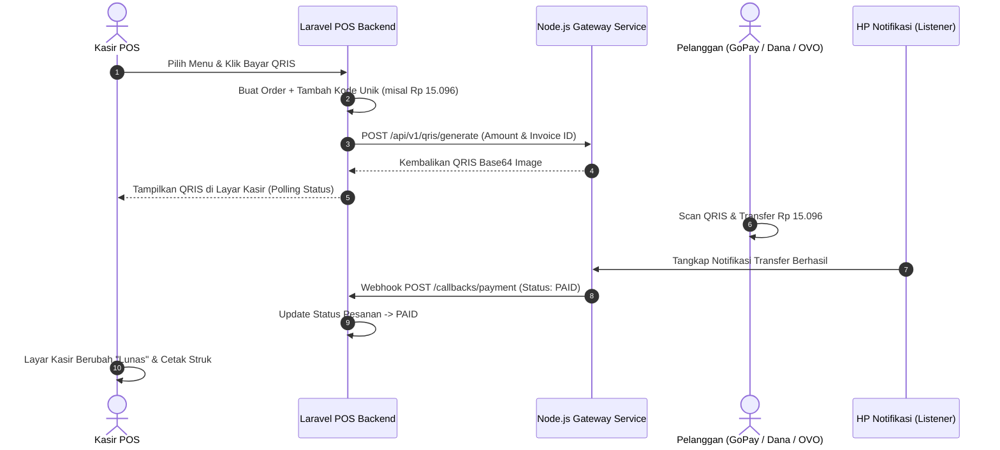

# 🛒 POSPro - Modern Point of Sale & Mini Payment Gateway QRIS System

<p align="center">

</p>

<p align="center">
  <strong>Sistem Aplikasi Kasir (Point of Sale) Full-Stack Modern berbasis Laravel 12, Alpine.js, Tailwind CSS, dan Mini Payment Gateway QRIS Dinamis.</strong>
</p>

<p align="center">
  
  
  
  
  
</p>

---

## 🌟 Fitur Utama (Key Features)

### 1. 🖥️ Layar Kasir Interaktif (Touch-Friendly POS) - `/`
- **Tampilan Responsif Multi-Device**:
  - **Desktop / Tablet**: Tampilan berdampingan (*Side-by-Side* Katalog 70% & Keranjang 30%).
  - **Smartphone (Portrait)**: Tampilan katalog 2 kolom, *floating bar* total pesanan, dan *drawer cart* geser yang ramah sentuhan jari.
- **Pencarian Cepat & Barcode Scanner**: Dukungan scan barcode dengan enter otomatis masuk ke keranjang, serta live search berdasarkan nama menu dan SKU.
- **Audio Feedback**: Bunyi *beep sound effect* instan saat memilih menu, mengubah jumlah item, atau menekan numpad.
- **Parkir Pesanan (Hold & Recall Orders)**: Fitur menahan pesanan pelanggan yang belum selesai dan memanggilnya kembali kapan saja (tersimpan di *localStorage*).
- **Wajib Nama Pelanggan / Nomor Meja**: Modal input nama pelanggan dengan preset instan (*Dine In, Take Away, Meja 1-3, Ojol*).
- **Diskon Berbasis Persen (%)**: Dilengkapi tombol preset cepat `0%`, `5%`, `10%`, `20%`, `50%` dengan kalkulasi potongan Rupiah secara live.
- **Numpad Sentuh & Presets Uang Pas**: Input nominal tunai cepat (*Uang Pas, 10k, 20k, 50k, 100k, 200k*) dan kalkulasi uang kembalian otomatis.

---

### 2. ☕ All-in-One Mode (Cafe/Resto vs Warung/Retail)
Setiap produk dapat diatur jenis pengelolaannya:
- **Mode Cafe / Resto (`Kelola Stok: OFF`)**:
  - Untuk menu olahan/masakan (*Kopi, Espresso, Makanan Olahan*).
  - Menampilkan badge **"Ready"** ungu di katalog dan tidak membatasi pesanan.
- **Mode Warung / Retail (`Kelola Stok: ON`)**:
  - Untuk produk fisik/kemasan (*Snack, Minuman Botol, Rokok*).
  - Menampilkan badge **"Stok: X"** (kuning jika &le; 5, merah jika habis).
  - Otomatis memotong kuantiti stok saat checkout berhasil.

---

### 3. 🎨 Master Kategori dengan Pewarnaan Standar Industri
Mendukung 9 palet warna visual standar F&B & Retail POS:
- 🟤 **Amber / Cokelat**: Kopi, Espresso, Roti Gandum
- 🟠 **Oranye**: Makanan Utama, Fast Food, Gorengan
- 🟢 **Emerald / Hijau**: Makanan Sehat, Salad, Snack, Matcha
- 🔵 **Biru**: Minuman Dingin, Jus, Air Mineral
- 🔷 **Teal / Cyan**: Mocktail, Es Buah, Minuman Segar
- 🟣 **Ungu**: Dessert, Pastry, Kue, Es Krim, Signature Menu
- 🔴 **Rose / Merah**: Promo, Best Seller, Menu Pedas
- 🟡 **Kuning**: Sarapan, Keju, Extra Topping
- ⚫ **Slate / Abu-abu**: Perlengkapan, Kemasan Takeaway, Merchandise

---

### 4. 💳 Pembayaran Fleksibel (Tunai & QRIS Gateway)
- **Tunai (Cash)**: 100% mandiri tanpa ketergantungan server eksternal, langsung lunas dan mencetak struk kasir.
- **QRIS Dinamis**: Terintegrasi dengan Node.js Payment Gateway:
  - Generate gambar QRIS otomatis dengan tambahan *Kode Unik* (misal: Rp 15.000 + 96 = Rp 15.096).
  - Layar kasir melakukan polling status secara real-time.
  - Webhook callback `/callbacks/payment` otomatis mengubah status transaksi menjadi `PAID`.

---

### 5. 🧾 Struk Thermal & Rekapitulasi Laporan PDF
- **Struk Thermal Kasir (`/print-receipt/{orderId}`)**:
  - Dioptimalkan khusus untuk printer thermal **58mm** dan **80mm** (CSS `@media print`).
  - Menampilkan identitas toko, rincian menu, diskon %, biaya layanan %, PPN %, kode unik, tunai diterima, kembalian, dan catatan kaki.
- **Laporan Rekapitulasi PDF Resmi (`/admin/history/export-pdf`)**:
  - Menggunakan engine **DomPDF**.
  - Kop resmi toko, matriks KPI finansial (Gross, Diskon, Layanan, PPN, Net), tabel 5 menu terlaris, rincian seluruh pesanan, dan kolom tanda tangan pengesahan.

---

### 6. 🏛️ Pengaturan Pajak PPN & Biaya Layanan (`/admin/settings`)
- Pengaturan identitas toko (Nama Toko, Alamat Lengkap, Nomor Telepon/WhatsApp, Catatan Kaki Struk).
- **Pajak PPN**: Opsi aktif/non-aktif (*Toggle Switch*) dan tarif persentase custom (default `11%`).
- **Biaya Layanan (Service Charge)**: Opsi aktif/non-aktif (*Toggle Switch*) dan tarif persentase custom (default `5%`).

---

### 7. 🛡️ Hak Akses Multi-User (Role-Based Access Control)
- **Super Admin (`role = admin`)**: Akses penuh ke Dashboard, Kategori, Produk, Kelola User/Kasir, Riwayat Laporan, dan Pengaturan Toko.
- **Kasir (`role = kasir`)**: Akses difokuskan hanya pada Layar Kasir POS (`/`), Proses Bayar, Cetak Struk, dan Riwayat Penjualan. Halaman admin otomatis terkunci.

---

## 🏗️ Struktur & Arsitektur Direktori

```
pos/
├── app/
│   ├── Http/
│   │   ├── Controllers/
│   │   │   ├── AdminController.php        # Dashboard KPI, Riwayat & Export PDF
│   │   │   ├── CategoryController.php     # CRUD Kategori Menu
│   │   │   ├── POSController.php          # Layar Kasir, Checkout, Status & Struk
│   │   │   ├── ProductController.php      # CRUD Produk & Unggah Gambar (Up to 50MB)
│   │   │   ├── SettingController.php      # Pengaturan Toko, Pajak PPN & Layanan
│   │   │   └── UserController.php         # Manajemen Pengguna & Kasir
│   │   └── Middleware/
│   │       └── AdminMiddleware.php        # Proteksi hak akses Administrator
│   └── Models/
│       ├── Category.php                   # Model Kategori & Helper Warna
│       ├── Order.php                      # Model Transaksi Pesanan
│       ├── OrderItem.php                  # Model Item Detail Pesanan
│       ├── Product.php                    # Model Produk & Accessor Gambar
│       ├── Setting.php                    # Model Pengaturan Key-Value
│       └── User.php                       # Model Pengguna & Role Helper
├── database/
│   ├── migrations/                        # Skema Database MySQL
│   └── seeders/
│       └── DatabaseSeeder.php             # Seeder Default Akun, Kategori & Menu
├── resources/
│   └── views/
│       ├── admin/
│       │   ├── categories/                # Tampilan Master Kategori
│       │   ├── reports/sales_pdf.blade.php# Template Laporan PDF
│       │   ├── settings/index.blade.php   # Tampilan Pengaturan Toko & Pajak
│       │   ├── users/                     # Tampilan Master User & Kasir
│       │   └── history.blade.php          # Tampilan Riwayat & Filter Rentang Tanggal
│       ├── auth/                          # Tampilan Login & Register Modern
│       ├── pos/
│       │   ├── checkout.blade.php         # Layar Tunggu QRIS Dinamis
│       │   ├── index.blade.php            # Layar Utama Kasir POS (Flagship)
│       │   └── receipt.blade.php          # Tampilan Struk Thermal 58mm/80mm
│       └── products/                      # Tampilan Master Produk
└── routes/
    └── web.php                            # Rute Web, Admin, POS & Webhooks
```

---

## 🚀 Panduan Instalasi & Menjalankan

### Persyaratan Sistem:
- **PHP**: &ge; 8.2 (dengan ekstensi `pdo_mysql`, `gd`, `mbstring`, `fileinfo`)
- **Composer**: &ge; 2.0
- **Node.js & NPM**: &ge; 18.x
- **MySQL / MariaDB Database**

---

### Langkah-langkah Instalasi:

1. **Clone atau Buka Direktori Project**:
   ```bash
   cd c:/Users/Indruyy/Documents/codingan/paymentgateway/pos
   ```

2. **Install Dependensi PHP & Node.js**:
   ```bash
   composer install
   npm install
   ```

3. **Konfigurasi Environment (`.env`)**:
   Pastikan file `.env` telah dikonfigurasi dengan kredensial database Anda:
   ```env
   APP_NAME="POSPro"
   APP_URL=http://localhost:8000

   DB_CONNECTION=mysql
   DB_HOST=127.0.0.1
   DB_PORT=3306
   DB_DATABASE=pos
   DB_USERNAME=root
   DB_PASSWORD=

   # Konfigurasi Mini Payment Gateway (Jika Digunakan)
   PAYMENT_GATEWAY_URL=http://localhost:3000/api/v1/qris/generate
   PAYMENT_GATEWAY_API_KEY=secret_key_hp_123
   BACKEND_API_KEY=secret_backend_123
   ```

4. **Generate Application Key**:
   ```bash
   php artisan key:generate
   ```

5. **Buat Symbolic Link Storage (Untuk Foto Produk)**:
   ```bash
   php artisan storage:link
   ```

6. **Migrasi Database & Seeder Data Awal**:
   ```bash
   php artisan migrate --seed
   ```

7. **Kompilasi Aset Frontend (Tailwind & Vite)**:
   ```bash
   npm run build
   ```

8. **Jalankan Server Laravel**:
   ```bash
   php artisan serve
   ```
   Aplikasi siap diakses di browser pada: **`http://localhost:8000`**

---

## 🔑 Akun Default Bawaan (Default Credentials)

| Peran (Role) | Email Akun | Password | Akses & Wewenang |
| :--- | :--- | :--- | :--- |
| 👑 **Super Admin** | `admin@pos.com` | `password` | Akses penuh ke seluruh menu, master produk, kategori, user, laporan finansial, dan pengaturan toko. |
| 🧑‍💼 **Kasir 01** | `kasir@pos.com` | `password` | Akses khusus ke Layar Kasir POS (`/`), Proses Transaksi, Cetak Struk, dan Riwayat Penjualan. |

> **Tip**: Pada halaman Login (`/login`), tersedia tombol **1-Click Autofill** untuk langsung mengisi kredensial Admin atau Kasir secara instan.

---

## 💳 Alur Integrasi QRIS Mini Payment Gateway



---

## 📄 Lisensi
Sistem ini dibuat dan dikembangkan di bawah lisensi [MIT License](LICENSE).
