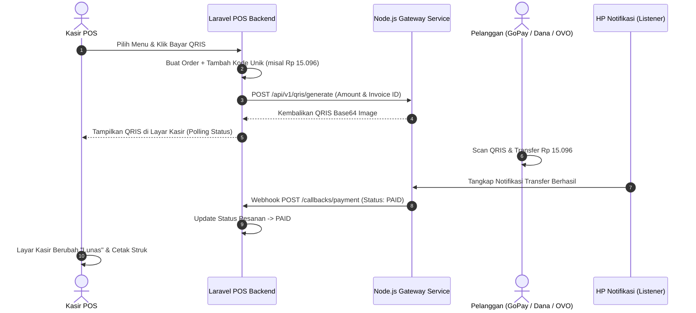

# 🛒 POSPro - Modern Point of Sale & Mini Payment Gateway QRIS System

<p align="center">

</p>

<p align="center">
  <strong>Sistem Aplikasi Kasir (Point of Sale) Full-Stack Modern berbasis Laravel 12, Alpine.js, Tailwind CSS, Mini Payment Gateway QRIS Dinamis, dan Modul F&B / Retail Lengkap.</strong>
</p>

<p align="center">
  
  
  
  
  
</p>

---

## 🌟 Fitur Utama (Key Features)

### 1. 🖥️ Layar Kasir Interaktif (Touch-Friendly POS) - `/`
- **Tampilan Responsif Multi-Device**:
  - **Desktop / Tablet**: Tampilan berdampingan (*Side-by-Side* Katalog 70% & Keranjang 30%).
  - **Smartphone (Portrait)**: Tampilan katalog 2 kolom, *floating bar* total pesanan, dan *drawer cart* geser yang ramah sentuhan jari.
- **Pencarian Cepat & Barcode Scanner**: Dukungan scan barcode fisik / scanner bluetooth dengan enter otomatis masuk ke keranjang, serta live search berdasarkan nama menu dan SKU.
- **Audio Feedback**: Bunyi *beep sound effect* instan saat memilih menu, mengubah jumlah item, atau menekan numpad.
- **Parkir Pesanan (Hold & Recall Orders)**: Fitur menahan pesanan pelanggan yang belum selesai dan memanggilnya kembali kapan saja (tersimpan di *localStorage*).
- **Wajib Nama Pelanggan / Nomor Meja**: Modal input nama pelanggan dengan preset instan (*Dine In, Take Away, Meja 1-3, Ojol*).
- **Numpad Sentuh & Presets Uang Pas**: Input nominal tunai cepat (*Uang Pas, 10k, 20k, 50k, 100k, 200k*) dan kalkulasi uang kembalian otomatis.

---

### 2. 🎟️ Kupon Promo, Voucher Kategori & Pemindai QR Kamera
- **Kupon Global & Spesifik Kategori**:
  - Kupon dapat berlaku untuk **Semua Menu** atau **Kategori Tertentu** (misal: *Khusus Kategori Coffee & Espresso*, *Khusus Makanan*, dll).
  - Potongan harga hanya akan dihitung dari item dalam keranjang yang memenuhi syarat kategori kupon.
- **📷 Live Camera QR Scanner (Kamera HP / Laptop Bawaan)**:
  - Tombol **"Scan QR"** langsung menyalakan kamera perangkat menggunakan library `html5-qrcode`.
  - Mengarahkan QR kupon ke kamera langsung mendeteksi kode dan menerapkan diskon secara otomatis.
- **Kartu Voucher One-Tap**: Kasir dapat langsung menekan tombol **"Gunakan"** pada daftar kupon aktif yang tersedia.
- **Diskon Manual (%)**: Input persentase diskon fleksibel dengan preset cepat `0%`, `5%`, `10%`, `20%`, `50%`.
- **Admin Kupon (`/admin/coupons`)**: Master data CRUD kupon, kuota penggunaan, masa berlaku, dan generator gambar QR code yang bisa dicetak/diunduh.

---

### 3. 📝 Catatan Khusus Per Item (Item Notes / Modifiers)
- Kasir dapat menambahkan catatan khusus pada menu (*misal: "Less Sugar", "Pedas Sedang", "Tanpa Bawang", "Es Sedikit"*).
- Fitur ini khusus disediakan untuk **menu tanpa stok / cafe & resto** (`manage_stock = false`).
- Catatan menu tersimpan ke database detail pesanan dan ikut tercetak rapi pada **Struk Kasir** maupun **Struk Dapur (KOT)**.

---

### 4. 🍳 Struk Tiket Dapur / Bar (Kitchen Order Ticket - KOT)
- **Tombol Cetak Struk Dapur (`/print-kitchen/{orderId}`)**:
  - Struk format thermal khusus kru dapur dan barista yang hanya menampilkan **Nomor Meja/Pelanggan, Waktu Order, Daftar Menu, Kuantiti, dan Catatan Khusus** (tanpa memunculkan harga atau total tagihan).
- **Opsi Aktif/Nonaktif di Pengaturan**: Admin dapat mengaktifkan atau menonaktifkan fitur cetak struk dapur melalui menu **Settings** (`/admin/settings`).

---

### 5. 🚫 Void / Pembatalan Transaksi dengan Pengembalian Stok Otomatis
- Transaksi yang salah ketik atau dibatalkan pelanggan dapat di-*void* melalui menu **Riwayat Transaksi** (`/admin/history`).
- **Input Alasan Pembatalan**: Kasir/Admin wajib menginput alasan *void* (misal: *"Salah Meja"*, *"Pelanggan Membatalkan"*).
- **Auto Stock Return**: Sistem secara otomatis mengembalikan jumlah kuantiti stok produk fisik (`stock += qty`) ke database inventori.
- Transaksi berstatus `VOID` otomatis dieksklusi dari kalkulasi total omset dan laba bersih di dashboard KPI.

---

### 6. 🍽️ Mode Tipe Pesanan (Dine In vs Take Away) & Fleksibilitas Biaya Layanan
- **Dine In vs Take Away Switcher**:
  - Kasir dapat memilih tipe pesanan **Dine In (Makan di Tempat)** atau **Take Away (Bungkus)** langsung dari sidebar keranjang kasir.
- **Bebas Biaya Layanan pada Take Away**:
  - Diatur melalui Pengaturan Admin (`/admin/settings`). Secara default standar F&B, pesanan Take Away otomatis dibebaskan dari biaya layanan (*Service Charge = Rp 0*).
- **Mode Warung / Retail Murni**:
  - Fitur Dine In / Take Away dapat dinonaktifkan sepenuhnya di Admin Settings jika POS digunakan untuk usaha warung, minimarket, atau toko retail kelontong biasa (`order_type = null`).

---

### 7. ☕ All-in-One Mode (Cafe/Resto vs Warung/Retail)
Setiap produk dapat diatur jenis pengelolaannya:
- **Mode Cafe / Resto (`Kelola Stok: OFF`)**:
  - Untuk menu olahan/masakan (*Kopi, Espresso, Makanan Olahan*).
  - Menampilkan badge **"Ready"** di katalog dan tidak membatasi pesanan. Barcode bersifat opsional.
- **Mode Warung / Retail (`Kelola Stok: ON`)**:
  - Untuk produk fisik/kemasan (*Snack, Minuman Botol, Rokok*).
  - Menampilkan badge **"Stok: X"** (kuning jika &le; 5, merah jika habis).
  - Otomatis memotong kuantiti stok saat transaksi berhasil.

---

### 7. 🎨 Master Kategori dengan Pewarnaan Visual Standar F&B
Mendukung 9 palet warna visual standar F&B & Retail POS:
- 🟤 **Amber / Cokelat**: Kopi, Espresso, Roti Gandum
- 🟠 **Oranye**: Makanan Utama, Fast Food, Gorengan
- 🟢 **Emerald / Hijau**: Makanan Sehat, Salad, Snack, Matcha
- 🔵 **Biru**: Minuman Dingin, Jus, Air Mineral
- 🔷 **Teal / Cyan**: Mocktail, Es Buah, Minuman Segar
- 🟣 **Ungu**: Dessert, Pastry, Kue, Es Krim, Signature Menu
- 🔴 **Rose / Merah**: Promo, Best Seller, Menu Pedas
- 🟡 **Kuning**: Sarapan, Keju, Extra Topping
- ⚫ **Slate / Abu-abu**: Perlengkapan, Kemasan Takeaway, Merchandise

---

### 8. 💳 Pembayaran Fleksibel (Tunai & QRIS Gateway)
- **Tunai (Cash)**: 100% mandiri tanpa ketergantungan server eksternal, langsung lunas dan mencetak struk kasir.
- **QRIS Dinamis**: Terintegrasi dengan Node.js Payment Gateway:
  - Generate gambar QRIS otomatis dengan tambahan *Kode Unik* (misal: Rp 15.000 + 96 = Rp 15.096).
  - Layar kasir melakukan polling status secara real-time.
  - Webhook callback `/callbacks/payment` otomatis mengubah status transaksi menjadi `PAID`.

---

### 9. 🧾 Struk Thermal & Rekapitulasi Laporan PDF
- **Struk Kasir (`/print-receipt/{orderId}`)**: Khusus printer thermal **58mm** dan **80mm** (CSS `@media print`), memuat identitas toko, rincian menu, catatan item, kupon voucher, diskon, PPN, biaya layanan, dan kembalian.
- **Struk Dapur (`/print-kitchen/{orderId}`)**: Khusus kru dapur dan bar tanpa memuat nominal harga.
- **Laporan PDF Rekapitulasi Penjualan (`/admin/history/export-pdf`)**: Format resmi DomPDF dengan matriks KPI finansial, top menu terlaris, rincian transaksi, dan kolom tanda tangan pengesahan.

---

### 10. 🏛️ Pengaturan Pajak PPN, Service Charge & Dapur (`/admin/settings`)
- Pengaturan identitas toko (Nama Toko, Alamat Lengkap, Nomor WhatsApp, Catatan Kaki Struk).
- **Pajak PPN**: Opsi toggle switch dan persentase custom (default `11%`).
- **Biaya Layanan (Service Charge)**: Opsi toggle switch dan persentase custom (default `5%`).
- **Fitur Struk Dapur**: Opsi toggle switch untuk menampilkan/menyembunyikan tombol cetak tiket dapur.

---

## 🏗️ Struktur Direktori Utama

```
pos/
├── app/
│   ├── Http/
│   │   ├── Controllers/
│   │   │   ├── AdminController.php        # Dashboard KPI, Riwayat, Void & Export PDF
│   │   │   ├── CategoryController.php     # CRUD Kategori Menu & Palet Warna
│   │   │   ├── CouponController.php       # CRUD Kupon Promo, Kategori & QR Code
│   │   │   ├── POSController.php          # Layar Kasir, Checkout, Notes, Kupon & Struk
│   │   │   ├── ProductController.php      # CRUD Produk (Stok Kelola / Unlimited)
│   │   │   ├── SettingController.php      # Pengaturan Toko, Pajak, Layanan & KOT
│   │   │   └── UserController.php         # Manajemen Pengguna & Kasir
│   │   └── Middleware/
│   │       └── AdminMiddleware.php        # Proteksi Hak Akses Administrator
│   └── Models/
│       ├── Category.php                   # Model Kategori & Helper Warna
│       ├── Coupon.php                     # Model Kupon, Validasi & Hitung Diskon
│       ├── Order.php                      # Model Transaksi Pesanan & Status Void
│       ├── OrderItem.php                  # Model Detail Pesanan & Catatan Khusus
│       ├── Product.php                    # Model Produk & Stok
│       ├── Setting.php                    # Model Pengaturan Key-Value
│       └── User.php                       # Model Pengguna & Role
├── database/
│   ├── migrations/                        # Skema Database MySQL (Coupons, Void, Notes)
│   └── seeders/
│       └── DatabaseSeeder.php             # Seeder Default Akun, Kategori, Menu & Kupon
├── resources/
│   └── views/
│       ├── admin/
│       │   ├── categories/                # Master Kategori
│       │   ├── coupons/                   # Master Kupon & Generator QR Code
│       │   ├── settings/                  # Pengaturan Toko, Pajak & Dapur
│       │   ├── users/                     # Master User & Kasir
│       │   └── history.blade.php          # Riwayat Transaksi & Fitur Void
│       ├── pos/
│       │   ├── checkout.blade.php         # Layar Tunggu QRIS Dinamis
│       │   ├── index.blade.php            # Layar Utama Kasir POS (Flagship)
│       │   ├── receipt.blade.php          # Struk Thermal Kasir 58mm/80mm
│       │   └── kitchen_receipt.blade.php  # Tiket Dapur / Bar (KOT)
│       └── products/                      # Master Produk
└── routes/
    └── web.php                            # Definisi Rute Web, Admin, POS & Webhook
```

---

## 🚀 Panduan Instalasi & Menjalankan

### Persyaratan Sistem:
- **PHP**: &ge; 8.2 (dengan ekstensi `pdo_mysql`, `gd`, `mbstring`, `fileinfo`)
- **Composer**: &ge; 2.0
- **Node.js & NPM**: &ge; 18.x
- **MySQL / MariaDB Database**

---

### Langkah-langkah Instalasi:

1. **Clone atau Buka Direktori Project**:
   ```bash
   cd c:/Users/Indruyy/Documents/codingan/paymentgateway/pos
   ```

2. **Install Dependensi PHP & Node.js**:
   ```bash
   composer install
   npm install
   ```

3. **Konfigurasi Database & Payment Gateway (`.env`)**:
   ```env
   APP_NAME="POSPro"
   APP_URL=http://localhost:8000

   DB_CONNECTION=mysql
   DB_HOST=127.0.0.1
   DB_PORT=3306
   DB_DATABASE=pos
   DB_USERNAME=root
   DB_PASSWORD=

   # ==========================================
   # MINI PAYMENT GATEWAY & QRIS INTEGRATION
   # ==========================================
   PAYMENT_GATEWAY_URL=http://localhost:3000/api/v1/qris/generate
   PAYMENT_GATEWAY_API_KEY=secret_key_hp_123
   BACKEND_API_KEY=secret_backend_123
   ```

4. **Generate Key & Symlink Storage**:
   ```bash
   php artisan key:generate
   php artisan storage:link
   ```

5. **Migrasi Database & Seeder Awal**:
   ```bash
   php artisan migrate --seed
   ```

6. **Kompilasi Aset Frontend**:
   ```bash
   npm run build
   ```

7. **Jalankan Server Laravel**:
   ```bash
   php artisan serve
   ```
   Buka aplikasi di browser pada: **`http://localhost:8000`**

---

## 🔑 Akun Default Bawaan (Default Credentials)

| Peran (Role) | Email Akun | Password | Akses & Wewenang |
| :--- | :--- | :--- | :--- |
| 👑 **Super Admin** | `admin@pos.com` | `password` | Akses penuh ke seluruh menu master produk, kategori, kupon, user, laporan finansial, void transaksi, dan pengaturan toko. |
| 🧑‍💼 **Kasir 01** | `kasir@pos.com` | `password` | Akses khusus ke Layar Kasir POS (`/`), Proses Transaksi, Cetak Struk Kasir/Dapur, dan Riwayat Penjualan. |

---

## 💳 Alur Integrasi QRIS Mini Payment Gateway



---

## 📄 Lisensi
Sistem ini dibuat dan dikembangkan di bawah lisensi [MIT License](LICENSE).
